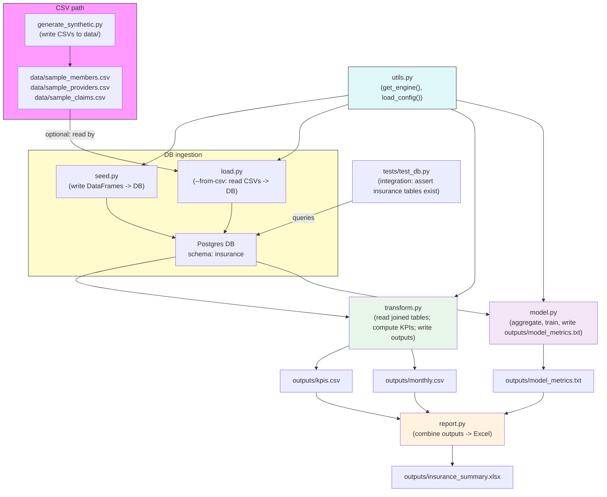

# Insurance Analytics Pipeline — Flow Diagram

Flow diagram describing the repository pipeline: data generation, ingestion, transform, modeling, and reporting.

```mermaid
flowchart TD
  subgraph CSV_Path[CSV path]
    GS["generate_synthetic.py\n(write CSVs to data/)"] --> CSVS["data/sample_members.csv\ndata/sample_providers.csv\ndata/sample_claims.csv"]
  end

  subgraph DB_Path[DB ingestion]
    SD["seed.py\n(write DataFrames -> DB)"] --> DB["Postgres DB\nschema: insurance"]
    LD["load.py\n(--from-csv: read CSVs -> DB)"] --> DB
  end

  CSVS -->|optional: read by| LD

  utils["utils.py\n(get_engine(), load_config())"] --> SD
  utils --> LD
  utils --> TR["transform.py\n(read joined tables; compute KPIs; write outputs)"]
  utils --> MO["model.py\n(aggregate, train, write outputs/model_metrics.txt)"]

  DB --> TR
  TR --> OUT1["outputs/kpis.csv"]
  TR --> OUT2["outputs/monthly.csv"]

  DB --> MO
  MO --> OUT3["outputs/model_metrics.txt"]

  OUT1 --> RP["report.py\n(combine outputs -> Excel)"]
  OUT2 --> RP
  OUT3 --> RP
  RP --> EXC["outputs/insurance_summary.xlsx"]

  TESTS["tests/test_db.py\n(integration: assert insurance tables exist)"] -->|queries| DB

  style CSV_Path fill:#f9f,stroke:#333,stroke-width:1px
  style DB_Path fill:#fffbcc,stroke:#333,stroke-width:1px
  style utils fill:#e0f7fa,stroke:#333
  style TR fill:#e8f5e9
  style MO fill:#f3e5f5
  style RP fill:#fff3e0
```
