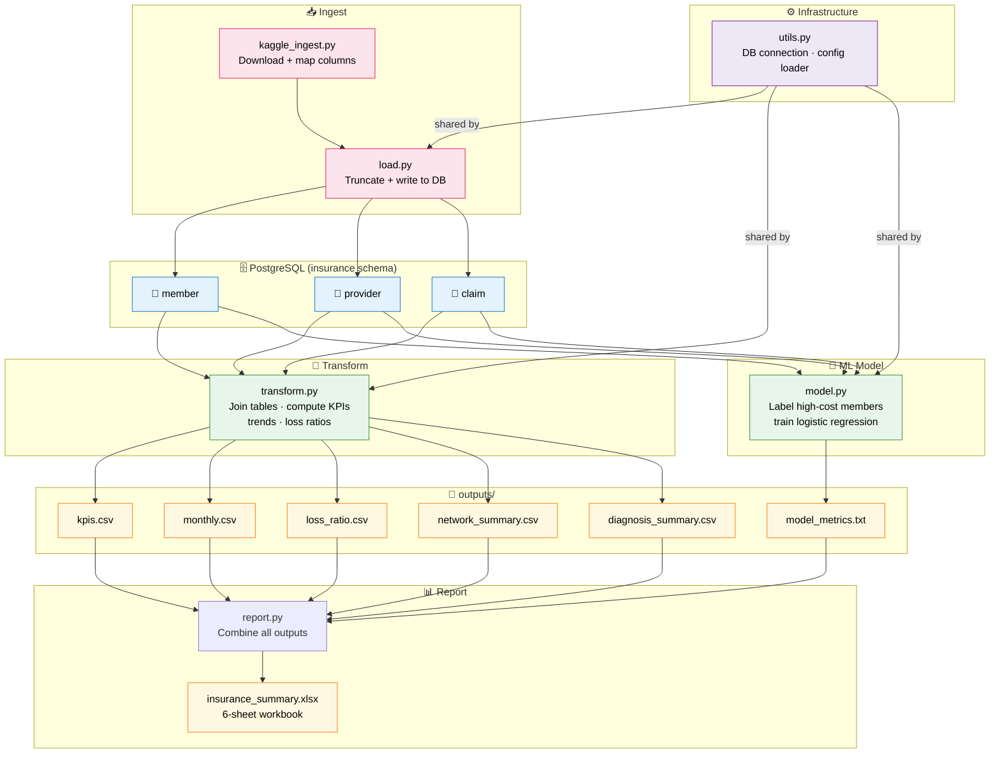

# 🗺️ Data Flow Diagram

> **Concept:** This diagram shows how data moves through the pipeline — from Kaggle download all the way to the final Excel report.

---

## 📋 Key Data Handoffs

| From | To | What passes |
|------|-----|------------|
| `kaggle_ingest.py` | `load.py` | Pandas DataFrames (member, provider, claim) |
| `load.py` | PostgreSQL | 3 relational tables |
| PostgreSQL | `transform.py` | SQL JOINed query results |
| `transform.py` | `outputs/` | 5 CSV files |
| `model.py` | `outputs/` | `model_metrics.txt` |
| `outputs/` | `report.py` | 6 files → 6 Excel sheets |
