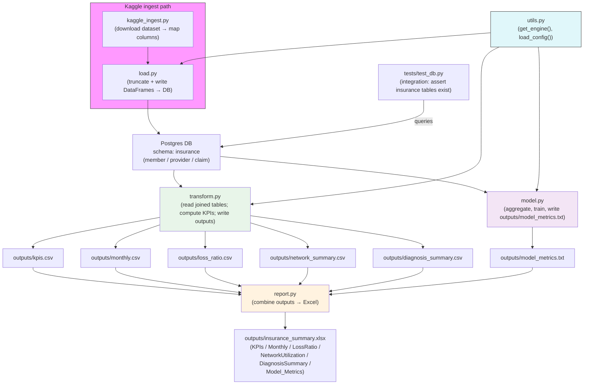

# Insurance Analytics Pipeline — Flow Diagram

Flow diagram describing the repository pipeline: Kaggle data ingestion, transform, modeling, and reporting.

```mermaid
flowchart TD
  subgraph Kaggle_Path[Kaggle ingest path]
    KI["kaggle_ingest.py\n(download dataset → map columns)"] --> LD["load.py\n(truncate + write DataFrames → DB)"]
  end

  LD --> DB["Postgres DB\nschema: insurance\n(member / provider / claim)"]

  utils["utils.py\n(get_engine(), load_config())"] --> LD
  utils --> TR["transform.py\n(read joined tables; compute KPIs; write outputs)"]
  utils --> MO["model.py\n(aggregate, train, write outputs/model_metrics.txt)"]

  DB --> TR
  TR --> OUT1["outputs/kpis.csv"]
  TR --> OUT2["outputs/monthly.csv"]
  TR --> OUT3["outputs/loss_ratio.csv"]
  TR --> OUT4["outputs/network_summary.csv"]
  TR --> OUT5["outputs/diagnosis_summary.csv"]

  DB --> MO
  MO --> OUT6["outputs/model_metrics.txt"]

  OUT1 --> RP["report.py\n(combine outputs → Excel)"]
  OUT2 --> RP
  OUT3 --> RP
  OUT4 --> RP
  OUT5 --> RP
  OUT6 --> RP
  RP --> EXC["outputs/insurance_summary.xlsx\n(KPIs / Monthly / LossRatio /\nNetworkUtilization / DiagnosisSummary /\nModel_Metrics)"]

  TESTS["tests/test_db.py\n(integration: assert insurance tables exist)"] -->|queries| DB

  style Kaggle_Path fill:#f9f,stroke:#333,stroke-width:1px
  style utils fill:#e0f7fa,stroke:#333
  style TR fill:#e8f5e9
  style MO fill:#f3e5f5
  style RP fill:#fff3e0
```
