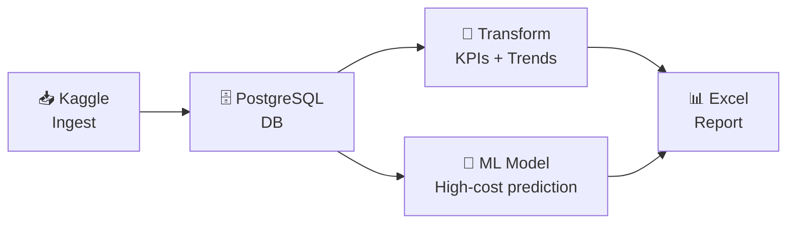

# 📚 Documentation Hub

> Welcome! This project is a **production-quality insurance analytics pipeline** built in Python. Whether you're brand new to data engineering or coming from a SAS background, start here.

---

## 🗺️ What Is This Project?

```
Raw insurance data  →  Clean DB tables  →  KPI reports  →  ML predictions  →  Excel workbook
     (Kaggle)            (PostgreSQL)        (5 CSVs)        (logistic reg.)     (6 sheets)
```

It's an **end-to-end data pipeline** that shows how real-world analytics workflows are built with Python — the same patterns used in production at insurance and healthcare companies.

---

## 📖 Documentation Map

```
docs/
 ├── index.md          ← You are here — start here!
 ├── architecture.md   ← How the pipeline is structured
 ├── flow_diagram.md   ← Visual data-flow diagram (Mermaid)
 ├── setup.md          ← How to run it on your machine
 ├── orchestration.md  ← Automate with Airflow or GitHub Actions
 ├── quality_guide.md  ← CI/CD and code quality gates
 └── git.md            ← Fix common Git issues in Dev Containers
```

---

## 🚦 Where Should I Start?

| I want to… | Go to |
|-----------|-------|
| 🏁 Get it running fast | [Setup Guide](setup.md) → Option A (Dev Container) |
| 🔍 Understand how it works | [Architecture](architecture.md) |
| 👁️ See it as a diagram | [Flow Diagram](flow_diagram.md) |
| ⏰ Run it on a schedule | [Orchestration](orchestration.md) |
| 🧹 Learn about code quality | [Quality Guide](quality_guide.md) |
| 🐙 Fix weird Git issues | [Git Tips](git.md) |
| 🐍 Learn the Python concepts | [concepts/README.md](../concepts/README.md) |
| 📓 Explore in Jupyter | [notebooks/README.md](../notebooks/README.md) |

---

## 🧩 Key Concepts at a Glance

| Concept | What it means here |
|---------|-------------------|
| **ETL** | Extract (Kaggle download) → Transform (KPIs) → Load (PostgreSQL) |
| **Star Schema** | Claims table linked to member & provider dimension tables |
| **KPI** | Key Performance Indicator — aggregated business metric (e.g. loss ratio) |
| **Loss Ratio** | `paid_amount / billed_amount` — how much of what was billed actually got paid |
| **ML Classification** | Predicting which members will be "high-cost" based on their claim history |
| **Idempotent** | Running the pipeline twice gives the same result — no duplicate data |
| **Orchestration** | Automatically running the pipeline on a schedule (Airflow / GitHub Actions) |

---

## 🛠️ Quick Commands

```bash
make help           # see all available commands
make kaggle-load    # download data from Kaggle and load into DB
make test           # run all tests
make lint           # check code style
make airflow-up     # start Airflow UI at http://localhost:8080
```

---

## 🔗 Pipeline at a Glance


